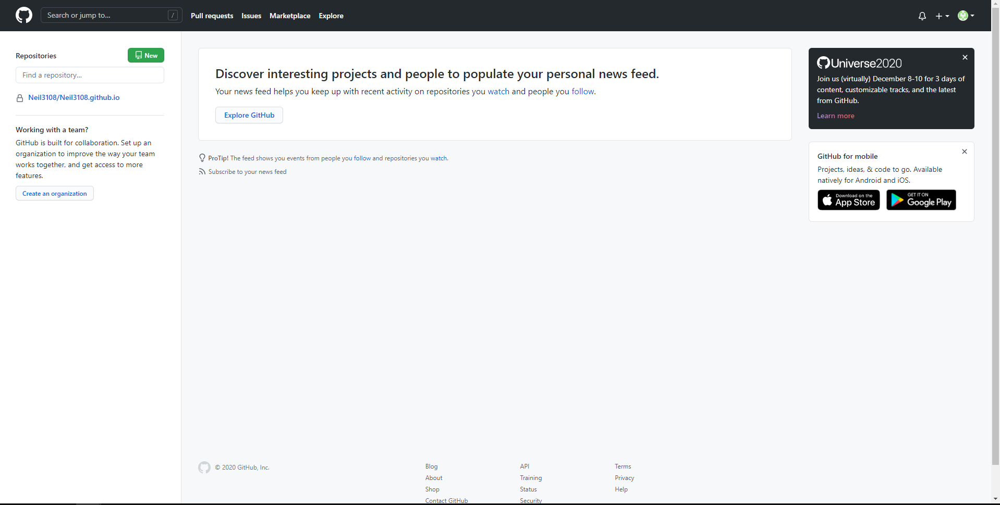
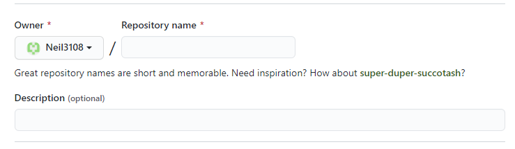
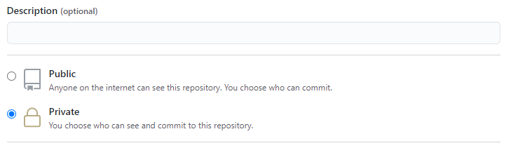
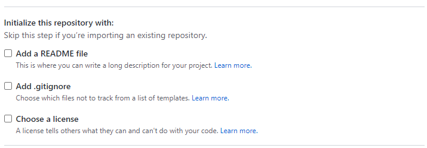
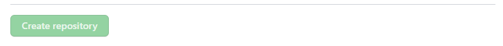
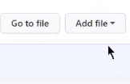
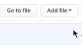

# Online resume hosting and formatting resume using Markdown
We will go through a step by step procedure on how to host your resume on Github and how you can format your resume using Markdown.

## Summary
 - [Getting started](#getting-started)
 - [Markdown](#markdown)
 - [Hosting the Resume](#hosting-the-resume)
 - [Changing the theme of your resume](#changing-the-theme-of-your-resume)
 - [Authors](#authors)
 - [Acknowledgments](#acknowledgments)
 - [FAQ](#faq)

## Getting started
asfdfads
### Prerequisites
You do need a resume already formated in Markdown and have a Github account. You can [visit](https://github.com/) to make a Github account.
 - ### Markdown
   Markdown is a lightweight markup language with plain-text-formatting syntax. You can learn the basic syntax for Markdown [HERE](https://www.markdownguide.org/basic-syntax/). There are number of Markdown editor avaiable and they come in many different syntax. We will fouces on Github Markdown.
As mentioned in the Andrew Etter's book Mordern Technical Writing because of the popularity of Markdown many specialized text editors exist for it. For example:
    - [MarkdownPad(Windows)](http://www.markdownpad.com/)
    - [iA Writer(macOS)](https://ia.net/writer)
    - [ReText(Linux)](https://sourceforge.net/directory/development/wordprocessors/os:windows/)
    
    There also are many online Markdown editors. The popular ones are:
    - [dillinger.io](https://dillinger.io/)
    - [stackedit.io](https://stackedit.io/)

## Hosting the Resume
Once you have a Github account and a resume formatted in Markdown you can host it on Github. Log into your Github account and the homepage of your account will open which will look this:

Now follow these steps:
#### **1. Making a new Repository**
1. In the upper-right corner of the page, click **New** to creat a new repository

2. Once you are in the creat new repositorie page, it will ask you to name the repositorie. Since we want to host our resume, we will name the repositorie as `YourUserName.github.io`. For example, if your user name is XYZ you should name your repositorie `XYZ.github.io`. You can also put a little description of your repository but that is optional.

3. Now you need to decide if you want to make your repository public or private. Since this is repository will contain your resume it would be better if you make it private. *Note: If you want to make a repository private you need Github pro.*

4. Finally, we initialize files that you want with the repository. This is optional but since we are making a resume we do not need any additional files.

5. Now we have selected all the properties for our repository and we just need to click on Creat repository.

#### **2. Adding your resume**
The file that will have your resume needs to be named `index.md`. There are two way to have your resume in repository. Making a new file and writing your resume directly in Github and uploading the file that already have your resume in Markdown.
1) **Making a new file**
    a. To make a new file, click on Add file at the upper center of the page and select Creat new file.
    

    
    

    b. Name the file `index.mb`.
    c. Write your resume in Markdown format in the text body.
    d. After you are done with the resume, click on Commit new file to creat the file.
    

    
    

2) **Uploading the file**
    a. To upload the file, click on Add file at the upper center of the page and select Upload files.
    

    
    

    b. Find and select the `index.md` file on your computer and click on Commit changes at the bottom of the page to upload the file.
    

    
    

